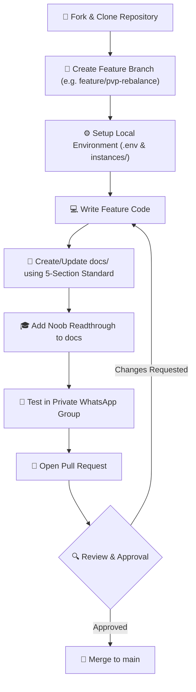

# 🤝 Contributing to Mellow's Bot

Thank you for your interest in contributing! This guide provides a hyper-detailed walkthrough for setting up your development environment, understanding the system architecture, finding existing documentation, and complying with our code and documentation standards.

---

## 🗺️ Contribution Pipeline



---

## 📚 Where to Learn (Skill Pathways)

If you are new to the technologies used in this bot, here is a curated list of where to study and what concepts are essential:

### 1. Modern JavaScript (ES6+) & Node.js
* **What to learn**: Promises, Asynchronous execution (`async/await`), Arrow Functions, Destructuring, Array methods (`map`, `filter`, `reduce`), and Node.js `AsyncLocalStorage`.
* **Resources**:
  * [MDN Web Docs - JavaScript Guide](https://developer.mozilla.org/en-US/docs/Web/JavaScript/Guide)
  * [JavaScript.info](https://javascript.info/)

### 2. WhatsApp Connectivity (Baileys)
* **What to learn**: Baileys socket connections, event emitter systems (`messages.upsert`, `connection.update`), and sending/receiving different message types (text, media, buttons, reactions).
* **Resources**:
  * [Baileys GitHub Repository & Examples](https://github.com/WhiskeySockets/Baileys)
  * [docs/engine.md](https://github.com/BrainMell/whatsapp-bot/blob/main/docs/engine.md) (Our implementation guide)

### 3. Database Layer (MongoDB & Mongoose)
* **What to learn**: Database connections, schemas, models, saving/updating data, queries, and transactions.
* **Resources**:
  * [Mongoose Documentation](https://mongoosejs.com/docs/)
  * [MongoDB Academy](https://university.mongodb.com/)
  * [docs/database/schema.md](https://github.com/BrainMell/whatsapp-bot/blob/main/docs/database/schema.md) (Our active collections schema)

### 4. AI & Language Models (Groq API)
* **What to learn**: Prompt engineering, chat completion endpoints, temperature/top_p parameters, and rate-limiting / rotation models.
* **Resources**:
  * [Groq Documentation](https://library.groq.com/)
  * [docs/chat/context_engine.md](https://github.com/BrainMell/whatsapp-bot/blob/main/docs/chat/context_engine.md) (Our context and topic memory engine)

---

## 🗂️ Documentation Directory Map

We organize our developer documentation by categories. Below is a comprehensive index of where to find documentation depending on what feature you are working on:

| Directory | Link | Purpose & Subsystems |
| :--- | :--- | :--- |
| **Project Root** | [README.md](https://github.com/BrainMell/whatsapp-bot/blob/main/README.md) | High-level system overview, setup, and entry points. |
| **Doc Index** | [docs/README.md](https://github.com/BrainMell/whatsapp-bot/blob/main/docs/README.md) | Category listing of all developers documentation. |
| **Admin & Mod** | [docs/admin/commands.md](https://github.com/BrainMell/whatsapp-bot/blob/main/docs/admin/commands.md) | Security blocks, antilink, muting, warnings, and group administration. |
| **Cards** | [docs/cards/info.md](https://github.com/BrainMell/whatsapp-bot/blob/main/docs/cards/info.md) | Card claims, deck building, market trades, collection sorting, and locking. |
| **Chat & AI** | [docs/chat/context_engine.md](https://github.com/BrainMell/whatsapp-bot/blob/main/docs/chat/context_engine.md) | Context buffers, chat history logging, and LLM summaries. |
| **Economy** | [docs/economy/economy.md](https://github.com/BrainMell/whatsapp-bot/blob/main/docs/economy/economy.md) | Wallet balances, daily check-ins, fixed investments, loans, and stocks. |
| **Gambling** | [docs/gambling/cups.md](https://github.com/BrainMell/whatsapp-bot/blob/main/docs/gambling/cups.md) | Minigames: Blackjack, Roulette, Cups, Crash, Penalty, Slots, etc. |
| **Group Games** | [docs/games/chess.md](https://github.com/BrainMell/whatsapp-bot/blob/main/docs/games/chess.md) | Chess, Ludo, Tic-Tac-Toe, Wordle, and AI debates. |
| **RPG Subsystems** | [docs/rpg/guide.md](https://github.com/BrainMell/whatsapp-bot/blob/main/docs/rpg/guide.md) | Character levels, gear upgrades, alchemy, blacksmithing, dungeons, and duels. |
| **Fun & Interact** | [docs/fun/fun_commands.md](https://github.com/BrainMell/whatsapp-bot/blob/main/docs/fun/fun_commands.md) | Jokes, trivia, coastal fishing, hunting, and anime reactions. |
| **Factions** | [docs/guilds/guilds.md](https://github.com/BrainMell/whatsapp-bot/blob/main/docs/guilds/guilds.md) | Guild creation, contribution logs, and daily hunting boards. |
| **Progression** | [docs/progression/progression.md](https://github.com/BrainMell/whatsapp-bot/blob/main/docs/progression/progression.md) | Level calculations, XP, and stat point allocations. |
| **Search & Media** | [docs/search/anime_search.md](https://github.com/BrainMell/whatsapp-bot/blob/main/docs/search/anime_search.md) |MAL searches, VS Battle power scalers, and rule34 scrapers. |
| **Profiles & Memory** | [docs/user-info/memory.md](https://github.com/BrainMell/whatsapp-bot/blob/main/docs/user-info/memory.md) | Custom profiles, nicknames, and group memory notes. |

---

## 🎨 Our Documentation Standards

Every documentation page you edit or create MUST follow our **5-Section Educational Standard** (inspired by the cups command documentation). This ensures that even beginners can easily understand the codebase and modify it.

### Required File Layout:

1. **Quick-Reference Note**:
   A prominent notice at the very beginning of the file telling developers exactly which source files and line ranges to open if they want to modify the logic or routing.
   ```markdown
   > [!IMPORTANT]
   > **Code Modification Quick-Reference**:
   > * **Feature Logic**: Go directly to `core/rpg/someSystem.js`.
   > * **Command Routing**: Check routing block in `core/engine.js`.
   ```

2. **Description**:
   A high-level explanation of the command or system from a user's perspective.

3. **Hierarchical Execution Tree & Step-by-Step Code Flow**:
   * A visual tree showing how the WhatsApp message flows down.
   * Specific code snippets containing real lines from the file, accompanied by metadata (Line Numbers, Called From, Defined In, Inputs, Outputs) and line-by-line explanations.

4. **How to Modify**:
   Practical, clear instructions and code snippets demonstrating how to change values, modifiers, multipliers, or configs.

5. **Noob Readthrough**:
   A dedicated section separated by 10 empty lines on both sides of a separator line (`---`). In this section:
   * Define each unique JavaScript concept present in the snippets.
   * Provide a short, generic JavaScript example.
   * Provide the specific project code snippet.
   * Explain how it works here, why it is used, and what breaks if you delete it.

---

## ⚙️ Setting Up Your Local Environment

### 1. Prerequisites
Ensure you have the following installed on your machine:
* [Node.js v18+](https://nodejs.org/)
* [MongoDB Community Server](https://www.mongodb.com/try/download/community) (Or a MongoDB Atlas cloud URI)
* [Git](https://git-scm.com/)

### 2. Installation
1. Clone the repository:
   ```bash
   git clone <repo-url>
   cd whatsapp-bot
   ```
2. Install dependencies:
   ```bash
   npm install
   ```

### 3. Environment Config
1. Create a `.env` file in the root of the project:
   ```bash
   touch .env
   ```
2. Configure it based on [docs/config/env.md](https://github.com/BrainMell/whatsapp-bot/blob/main/docs/config/env.md):
   ```ini
   # Add your local MongoDB and API Keys
   MONGODB_URI=mongodb://localhost:27017/mellowbot
   GROQ_API_KEYS=gsk_yourKey1,gsk_yourKey2
   GO_IMAGE_SERVICE_URL=http://localhost:8080
   ```

### 4. Running the Bot
```bash
node index.js
```
Scan the generated QR code in your console with your WhatsApp linked devices settings to boot the bot!

---

## 🛡️ Git & Security Rules

> [!CAUTION]
> **Keep Credentials Private**:
> Never commit your `.env` file, bot auth session folders (`instances/*/auth/`), or custom certificates to the repository. The `.gitignore` is pre-configured to block them. Double-check your staged files with `git status` before committing.

### Code Style Guidelines:
* **Preserve Documentation Integrity**: Keep existing comments and docstrings unless explicitly requested.
* **Keep Code Modular**: Keep route parsing in `core/engine.js` minimal. Always delegate command logic downstream to modules in `core/commands/` or system files in `core/rpg/` or `core/games/`.
* **Database Mutations**: Always write data mutations back to the database using `save()` or equivalent economyModule saves to prevent desync on crashes or restarts.
