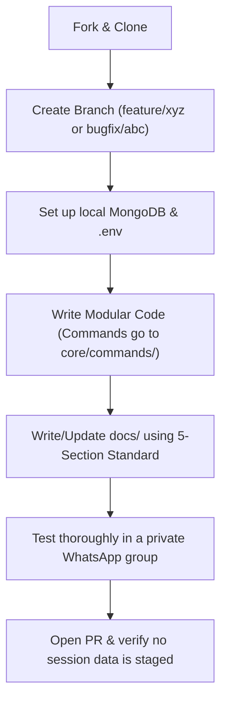

# Maintainer's Guide: Contributing to the Bot

If you're reading this, you probably want to add a feature, rebalance some RPG numbers, or fix a bug. Welcome! To make sure your pull request gets merged without a back-and-forth review cycle, read this guide carefully. It's written by the maintainers who work on this bot daily, and covers how this codebase actually functions, common mistakes to avoid, and what we look for during code reviews.

---

## 🛠️ The Core Development Flow

---

## 💻 Coding Rules & Common Codebase Pitfalls

This bot is high-traffic and multi-tenant. Writing code here is slightly different from a standard Node.js script. Pay attention to these codebase rules:

### 1. Never Bloat `core/engine.js`
`core/engine.js` is the entry point for WhatsApp socket events. It should only be used to validate prefixes, register routes, and delegate executions. 
* **Rule**: If you are adding a command, register the command string match in `core/engine.js`, then delegate all parsing and logic to a dedicated module in `core/commands/`, `core/rpg/`, or `core/games/`.
* **Example**: `.j forge` route check maps to `core/commands/rpgCommands.js` -> `forgeItem(sock, chatId, senderJid, item)`.

### 2. Guard Against Database Desync
We use MongoDB, but the bot relies heavily on fast in-memory lookups. 
* **Rule**: Whenever you mutate a user's wallet, stats, inventory, or guild data, you must call the corresponding persist/save methods (`economy.saveUser()`, `economy.saveGuild()`, etc.) immediately. 
* **Pitfall**: Mutating state in memory (e.g., `user.stats.hp = 0`) but forgetting to run `economy.saveUser(jid)` will result in loss of progress if the bot restarts or crashes.

### 3. Use the Multi-Tenant Config Proxy
This bot runs multiple instances from the same process. Never hardcode bot-specific configurations like prefix, currency symbols, or names.
* **Rule**: Import `./botConfig` and call its getters (e.g., `botConfig.getPrefix()`, `botConfig.getCurrency().symbol`). The module automatically fetches the configuration mapped to the active execution context via `AsyncLocalStorage`.

### 4. Clean Up Your Timers
Dangling timeouts and intervals are the leading cause of memory leaks and CPU spikes in this bot.
* **Rule**: If your command schedules a delayed event (like a quest registration window, shop break, combat turn, or PvP challenge expiry), always save the timer handle in the session state object (e.g., `state.timers.combat = setTimeout(...)`). During quest cancellation, combat exit, or normal session teardown, you must explicitly `clearTimeout()` or `clearInterval()` every handle.

### 5. Validate User Input Types
Never assume users will pass clean arguments. Players will try to break inputs (e.g., `.j buy sword -5`, `.j deposit NaN`, `.j pvp @user abc`).
* **Rule**: Always validate number inputs with `parseInt()` or `parseFloat()`, check for `isNaN()`, and enforce minimums (`Math.max(1, amount)`) to prevent negative input exploits or division-by-zero crashes.

---

## 📖 Documentation Expectations (The 5-Section Standard)

Every command or subsystem we write must be documented. We use a **5-Section Educational Standard** so that developers of all skill levels can easily understand how WhatsApp messages turn into state changes.

### How to document major systems:
* **Command Additions**: Focus on the route pattern, required permissions (admin/owner/user), argument validations, and message templates returned.
* **RPG Systems**: Highlight the base stats mutated, database keys affected (xp, level, pouch), turn timers scheduled, dynamic scaling multipliers, and specific Go Image Service rendering payloads.
* **Gambling Minigames**: Document the house edge, win probability formulas, payout multipliers, betting limits, and session limits to prevent macro exploitation.
* **Card Collectibles**: Explain collection claims, deck slot bindings, trade checks, and lock safety locks.

### Every doc page must contain:
1. **Quick-Reference Note**: An alert at the top linking to the exact logic file, command router line, and database models.
2. **What it is / Description**: User-facing summary.
3. **Hierarchical Execution Tree**: Merged trace mapping execution from Baileys packet upsert to routing, logic modules, and responses.
4. **How to Modify**: Step-by-step instructions showing where to alter multipliers, rates, prices, or cooldowns.
5. **Noob Readthrough**: A separation line (`---`) followed by a breakdown of every JavaScript concept used in the snippets (destructuring, array loops, async/await, database saves), explaining *why* it is used and what breaks if you delete it.

---

## 🧪 Testing Your Changes Locally

Before opening a pull request, you must test your code on a running bot.

1. **Local Setup**:
   * Run a local MongoDB instance.
   * Duplicate `.env.example` to `.env` and set your credentials.
   * Provide a valid `GROQ_API_KEYS` list (for AI features) and set `GO_IMAGE_SERVICE_URL` to your rendering endpoint.
2. **Launch a Test Instance**:
   * Create a dummy config under `instances/test/botConfig.json`.
   * Run the bot: `node index.js`.
   * Scan the terminal QR code using a secondary WhatsApp testing account.
3. **Run a Stress Test Checklist**:
   * Create a private WhatsApp group for testing.
   * **Boundary check**: Test negative bets, NaN values, empty pouches, and inventory overflows.
   * **Concurrency check**: Try starting multiple quests, or running an evolution trial during an active quest. Make sure the bot locks actions properly and does not spin up duplicate session states.
   * **Reboot check**: Boot the bot, perform some actions, kill the process, restart it, and verify that all progress (xp, currency, inventory mutations) was persisted to MongoDB.

---

## 🔍 What We Care About During Code Reviews

When we review your pull request, we prioritize the following:
* **No Session Leaks**: Double check `git status` before committing. Ensure you are not staging credentials in `instances/*/auth/` or local `.env` variables.
* **Separation of Concerns**: We will request changes if you write command logic directly inside the main `engine.js` file.
* **Timer Safety**: We verify that all timeout paths have clean exits and clear their handles.
* **Persisted Transactions**: We trace database mutations to ensure no data is left unpersisted in memory.
* **Documentation**: We check that your new system is documented under the `docs/` folder according to the 5-Section Standard.
