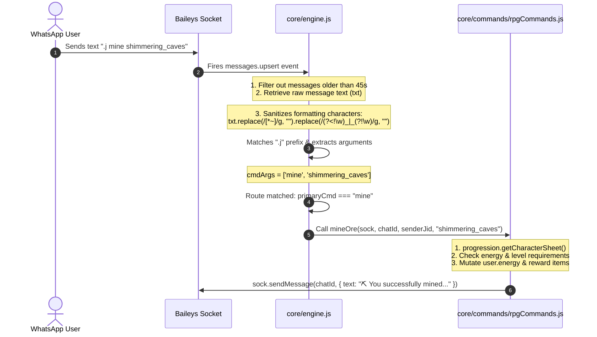

# Core System: Engine

## 1. What it is
The Engine system (`core/engine.js`) is the central orchestrator and message router of **Mellow's Bot**. It initializes the Baileys WhatsApp socket library, authenticates via multi-file storage, listens to network connection events, and intercepts incoming messages via a hot-path listener. It parses raw messaging payloads, verifies command prefixes, handles multi-tenant instances via thread-local state (`AsyncLocalStorage`), and routes execution to appropriate command modules.

---

## 2. Local Scope, Context & Dependencies
Any developer wishing to modify the engine or write command handlers must understand the input/output boundaries and state mutations.

### Inputs
* **Message Events**: Triggered by Baileys socket (`sock.ev.on("messages.upsert")`).
* **Configuration**: Loaded dynamically via `botConfig` helper (e.g. prefix, bot name, database connections).

### Outputs
* **WhatsApp Messages**: Sent to the WhatsApp network using `sock.sendMessage(chatId, content, options)`.

### State Mutations & Session Management
* **In-Memory Caches**:
  * `menuSessions` (`Map`): Map of `senderJid` -> `{ type: 'main'|'category', category: string|null, page: number }`.
  * `commandCooldowns` (`Map`): Cooldown timers per user.
* **Database States**: Mutates character levels, economy balances, and warning lists via Mongoose models.

### Key Dependencies
* `@whiskeysockets/baileys`: Core WhatsApp Protocol API client.
* `botConfig`: Multi-tenant configuration and storage manager.
* `core/utils/commandRegistry`: Command metadata database.
* Subsystem routers (e.g. `core/commands/rpgCommands.js`, `core/rpg/economy.js`).

---

## 3. The Blueprint Trace (Incoming Message Lifecycle)
This step-by-step trace acts like a live debugger explaining how an incoming message (e.g., `.j mine shimmering_caves`) is processed.



### Linear Code Trace
1. **Event Reception**:
   * WhatsApp servers deliver the message to the socket.
   * Baileys triggers `sock.ev.on("messages.upsert")` in `core/engine.js` (around line 4084).
2. **Backlog Check**:
   * The timestamp check `Date.now() - msgTime > 45000` filters out messages sent while the bot was offline.
3. **Thread Context Initialization**:
   * `botConfig.storage.run(configInstance, ...)` sets up dynamic scoping.
4. **Sanitation & The Underscore Fix**:
   * Raw text `txt` is processed to remove markdown delimiters for clean parsing.
   * **The Bug**: Previously, `txt.replace(/[*_~]/g, "")` stripped underscores globally, transforming `shimmering_caves` into `shimmeringcaves` and breaking location lookups.
   * **The Fix**: The new regex removes formatting markers but preserves internal underscores:
     ```javascript
     const cleanTxt = txt.replace(/[*~]/g, "").replace(/(?<!\w)_|_(?!\w)/g, "");
     ```
5. **Prefix Detection**:
   * The prefix (e.g., `.j`) is matched and stripped.
   * `cmdArgs` is populated: `['mine', 'shimmering_caves']`.
   * `primaryCmd` resolves to `"mine"`.
6. **Command Dispatch**:
   * The route condition matches at line 5131:
     ```javascript
     if (primaryCmd === "mine") {
       const locationId = cmdArgs[1]; // "shimmering_caves"
       await rpgCommands.mineOre(sock, chatId, senderJid, locationId);
       return;
     }
     ```
7. **Execution**:
   * `mineOre` (in `core/commands/rpgCommands.js`) queries the character sheet from progression system, loads valid mining zones via `craftingSystem.getMiningLocations()`, validates that `locations['shimmering_caves']` exists, verifies the user has enough energy, deducts energy, grants XP/items, and pushes the result back to the chat.

---

## 4. The Session State & Menu Pattern
Menus are fully paginated and track state per user, preventing extremely long WhatsApp message overflow.

### Layout Configs
* **Main Menu (Categories)**: Displays **6 categories per page**, arranged in 2 columns.
* **Category Menu (Commands)**: Displays **8 commands per page**.

### Page Navigation & Keywords
* `.j menu`: Renders page 1 of categories list and sets state `{ type: 'main', page: 1 }`.
* `.j menu <CATEGORY_NAME>`: Renders page 1 of commands in that category and sets state `{ type: 'category', category: CATEGORY_NAME, page: 1 }`.
* `.j menu <PAGE_NUMBER>`: Reads active session state from `menuSessions`. If active in category `RPG` and page is 1, typing `.j menu 2` will transition to page 2 of the `RPG` commands list.
* `.j menu next` / `.j menu prev`: Increments or decrements the current page in the active session context.

### Foolproof Trace to Add or Edit a Menu
If you want to add a new category and commands, or edit an existing menu:

1. **Register Category & Commands**:
   Open `core/utils/commandRegistry.js` and add your command to the registry dictionary:
   ```javascript
   const COMMAND_REGISTRY = {
     MY_NEW_CATEGORY: [
       { cmd: 'customcmd', desc: 'Runs my custom logic', usage: 'customcmd <arg>' }
     ],
     // ...
   }
   ```
2. **Assign Category Emoji**:
   Open `core/engine.js` and scroll to the `CATEGORY_EMOJIS` map declaration (around line 3080). Map your new category to a display emoji:
   ```javascript
   const CATEGORY_EMOJIS = {
     MY_NEW_CATEGORY: "🎯",
     // ...
   }
   ```
3. **Execution Routing**:
   Add a conditional block to parse and execute your command in the command dispatch loop of `core/engine.js`:
   ```javascript
   if (primaryCmd === "customcmd") {
     return reply("Custom action executed!");
   }
   ```
4. **Automatic Pagination**:
   You do **not** need to modify pagination logic! The `sendBotMenu` function automatically slices the `COMMAND_REGISTRY` entries dynamically based on page sizes (6 for main, 8 for sub-menus) and stores navigation states inside `menuSessions`.


---


# **Noob Readthrough**

This section is dedicated to complete beginners. If you have never programmed before, this guide will explain the general programming concepts used in the code snippets above, how they work in practice, why we use them in this project, and what happens if you change or remove them.

### Concept 1: Variables
Variables are used to store and manipulate data in a program. They have a name and a value, and can be changed or updated as needed.
**General Example**
```javascript
let name = "John";
console.log(name); // outputs "John"
```
**In Our Code**
```javascript
const cleanTxt = txt.replace(/[*~]/g, "").replace(/(?<!\w)_|_(?!\w)/g, "");
const COMMAND_REGISTRY = {
  // ...
}
```
**How it works here**: In the code, variables like `cleanTxt` and `COMMAND_REGISTRY` are used to store the result of a string replacement operation and a command registry object, respectively.
**Why it's used**: Variables are used to store and manipulate data, making it easier to write and understand the code.
**If you change/remove it**: If you remove the variable declarations, the code will throw an error because the variables are being used later in the code. If you change the variable names, you'll need to update all references to the variable to match the new name.

---
### Concept 2: String Replacement
String replacement is a method of replacing certain characters or patterns in a string with new characters or patterns.
**General Example**
```javascript
let str = "hello world";
str = str.replace("world", "earth");
console.log(str); // outputs "hello earth"
```
**In Our Code**
```javascript
const cleanTxt = txt.replace(/[*~]/g, "").replace(/(?<!\w)_|_(?!\w)/g, "");
```
**How it works here**: The code uses the `replace()` method to replace certain characters (`*` and `~`) and patterns (underscores at the start or end of a word) in the `txt` string with an empty string, effectively removing them.
**Why it's used**: String replacement is used to clean and normalize the input text, removing unwanted characters and patterns.
**If you change/remove it**: If you remove the string replacement, the input text will not be cleaned, and the program may not work as expected. If you change the replacement patterns, the cleaning process will be different, and the output may vary.

---
### Concept 3: Conditional Statements
Conditional statements are used to execute different blocks of code based on certain conditions or decisions.
**General Example**
```javascript
let age = 25;
if (age >= 18) {
  console.log("You are an adult");
} else {
  console.log("You are a minor");
}
```
**In Our Code**
```javascript
if (primaryCmd === "mine") {
  // ...
}
if (primaryCmd === "customcmd") {
  // ...
}
```
**How it works here**: The code uses `if` statements to check the value of the `primaryCmd` variable and execute different blocks of code based on its value.
**Why it's used**: Conditional statements are used to make decisions and execute different actions based on the input or state of the program.
**If you change/remove it**: If you remove the conditional statements, the program will not be able to make decisions and execute different actions. If you change the conditions, the program will make different decisions, and the output may vary.

---
### Concept 4: Objects
Objects are used to store and manipulate data in a structured way, using key-value pairs.
**General Example**
```javascript
let person = {
  name: "John",
  age: 30
};
console.log(person.name); // outputs "John"
```
**In Our Code**
```javascript
const COMMAND_REGISTRY = {
  MY_NEW_CATEGORY: [
    { cmd: 'customcmd', desc: 'Runs my custom logic', usage: 'customcmd <arg>' }
  ],
  // ...
}
const CATEGORY_EMOJIS = {
  MY_NEW_CATEGORY: "🎯",
  // ...
}
```
**How it works here**: The code uses objects to store command registries and category emojis, making it easy to access and manipulate the data.
**Why it's used**: Objects are used to store and manipulate data in a structured way, making it easier to write and understand the code.
**If you change/remove it**: If you remove the objects, the code will not be able to store and manipulate the data. If you change the object structure, the code will need to be updated to match the new structure.

---
### Concept 5: Arrays
Arrays are used to store and manipulate collections of data, using indexed values.
**General Example**
```javascript
let colors = ["red", "green", "blue"];
console.log(colors[0]); // outputs "red"
```
**In Our Code**
```javascript
const COMMAND_REGISTRY = {
  MY_NEW_CATEGORY: [
    { cmd: 'customcmd', desc: 'Runs my custom logic', usage: 'customcmd <arg>' }
  ],
  // ...
}
```
**How it works here**: The code uses arrays to store command registries, making it easy to access and manipulate the data.
**Why it's used**: Arrays are used to store and manipulate collections of data, making it easier to write and understand the code.
**If you change/remove it**: If you remove the arrays, the code will not be able to store and manipulate the data. If you change the array structure, the code will need to be updated to match the new structure.

---
### Concept 6: Async/Await
Async/await is a way to write asynchronous code that is easier to read and understand, using promises and callbacks.
**General Example**
```javascript
async function example() {
  let data = await fetchData();
  console.log(data);
}
```
**In Our Code**
```javascript
await rpgCommands.mineOre(sock, chatId, senderJid, locationId);
```
**How it works here**: The code uses async/await to execute the `mineOre` function asynchronously, waiting for the promise to resolve before continuing.
**Why it's used**: Async/await is used to write asynchronous code that is easier to read and understand, making it easier to handle promises and callbacks.
**If you change/remove it**: If you remove the async/await, the code will not be able to handle asynchronous operations correctly. If you change the async/await structure, the code will need to be updated to match the new structure.

---
### Concept 7: Functions
Functions are used to encapsulate code and reuse it, making it easier to write and understand the code.
**General Example**
```javascript
function greet(name) {
  console.log(`Hello, ${name}!`);
}
greet("John"); // outputs "Hello, John!"
```
**In Our Code**
```javascript
await rpgCommands.mineOre(sock, chatId, senderJid, locationId);
```
**How it works here**: The code uses functions to encapsulate code and reuse it, making it easier to write and understand the code.
**Why it's used**: Functions are used to encapsulate code and reuse it, making it easier to write and understand the code.
**If you change/remove it**: If you remove the functions, the code will not be able to encapsulate and reuse code. If you change the function structure, the code will need to be updated to match the new structure.

---
### Concept 8: Regular Expressions
Regular expressions are used to match patterns in strings, making it easier to search and manipulate text.
**General Example**
```javascript
let str = "hello world";
let regex = /world/;
console.log(str.match(regex)); // outputs ["world"]
```
**In Our Code**
```javascript
const cleanTxt = txt.replace(/[*~]/g, "").replace(/(?<!\w)_|_(?!\w)/g, "");
```
**How it works here**: The code uses regular expressions to match patterns in the `txt` string, replacing certain characters and patterns.
**Why it's used**: Regular expressions are used to match patterns in strings, making it easier to search and manipulate text.
**If you change/remove it**: If you remove the regular expressions, the code will not be able to match patterns in the string. If you change the regular expression patterns, the code will match different patterns, and the output may vary.
