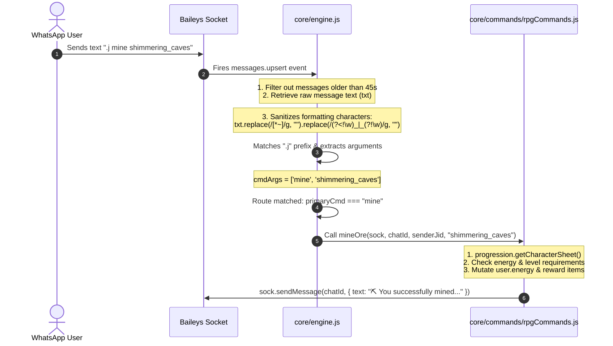

# Core System: Engine

## 1. What it is
The Engine system (`core/engine.js`) is the central orchestrator and message router of **Mellow's Bot**. It initializes the Baileys WhatsApp socket library, authenticates via multi-file storage, listens to network connection events, and intercepts incoming messages via a hot-path listener. It parses raw messaging payloads, verifies command prefixes, handles multi-tenant instances via thread-local state (`AsyncLocalStorage`), and routes execution to appropriate command modules.

---

## 2. Local Scope, Context & Dependencies
Any developer wishing to modify the engine or write command handlers must understand the input/output boundaries and state mutations.

### Inputs
* **Message Events**: Triggered by Baileys socket (`sock.ev.on("messages.upsert")`).
* **Configuration**: Loaded dynamically via `botConfig` helper (e.g. prefix, bot name, database connections).

### Outputs
* **WhatsApp Messages**: Sent to the WhatsApp network using `sock.sendMessage(chatId, content, options)`.

### State Mutations & Session Management
* **In-Memory Caches**:
  * `menuSessions` (`Map`): Map of `senderJid` -> `{ type: 'main'|'category', category: string|null, page: number }`.
  * `commandCooldowns` (`Map`): Cooldown timers per user.
* **Database States**: Mutates character levels, economy balances, and warning lists via Mongoose models.

### Key Dependencies
* `@whiskeysockets/baileys`: Core WhatsApp Protocol API client.
* `botConfig`: Multi-tenant configuration and storage manager.
* `core/utils/commandRegistry`: Command metadata database.
* Subsystem routers (e.g. `core/commands/rpgCommands.js`, `core/rpg/economy.js`).

---

## 3. The Blueprint Trace (Incoming Message Lifecycle)
This step-by-step trace acts like a live debugger explaining how an incoming message (e.g., `.j mine shimmering_caves`) is processed.



### Linear Code Trace
1. **Event Reception**:
   * WhatsApp servers deliver the message to the socket.
   * Baileys triggers `sock.ev.on("messages.upsert")` in `core/engine.js` (around line 4084).
2. **Backlog Check**:
   * The timestamp check `Date.now() - msgTime > 45000` filters out messages sent while the bot was offline.
3. **Thread Context Initialization**:
   * `botConfig.storage.run(configInstance, ...)` sets up dynamic scoping.
4. **Sanitation & The Underscore Fix**:
   * Raw text `txt` is processed to remove markdown delimiters for clean parsing.
   * **The Bug**: Previously, `txt.replace(/[*_~]/g, "")` stripped underscores globally, transforming `shimmering_caves` into `shimmeringcaves` and breaking location lookups.
   * **The Fix**: The new regex removes formatting markers but preserves internal underscores:
     ```javascript
     const cleanTxt = txt.replace(/[*~]/g, "").replace(/(?<!\w)_|_(?!\w)/g, "");
     ```
5. **Prefix Detection**:
   * The prefix (e.g., `.j`) is matched and stripped.
   * `cmdArgs` is populated: `['mine', 'shimmering_caves']`.
   * `primaryCmd` resolves to `"mine"`.
6. **Command Dispatch**:
   * The route condition matches at line 5131:
     ```javascript
     if (primaryCmd === "mine") {
       const locationId = cmdArgs[1]; // "shimmering_caves"
       await rpgCommands.mineOre(sock, chatId, senderJid, locationId);
       return;
     }
     ```
7. **Execution**:
   * `mineOre` (in `core/commands/rpgCommands.js`) queries the character sheet from progression system, loads valid mining zones via `craftingSystem.getMiningLocations()`, validates that `locations['shimmering_caves']` exists, verifies the user has enough energy, deducts energy, grants XP/items, and pushes the result back to the chat.

---

## 4. The Session State & Menu Pattern
Menus are fully paginated and track state per user, preventing extremely long WhatsApp message overflow.

### Layout Configs
* **Main Menu (Categories)**: Displays **6 categories per page**, arranged in 2 columns.
* **Category Menu (Commands)**: Displays **8 commands per page**.

### Page Navigation & Keywords
* `.j menu`: Renders page 1 of categories list and sets state `{ type: 'main', page: 1 }`.
* `.j menu <CATEGORY_NAME>`: Renders page 1 of commands in that category and sets state `{ type: 'category', category: CATEGORY_NAME, page: 1 }`.
* `.j menu <PAGE_NUMBER>`: Reads active session state from `menuSessions`. If active in category `RPG` and page is 1, typing `.j menu 2` will transition to page 2 of the `RPG` commands list.
* `.j menu next` / `.j menu prev`: Increments or decrements the current page in the active session context.

### Foolproof Trace to Add or Edit a Menu
If you want to add a new category and commands, or edit an existing menu:

1. **Register Category & Commands**:
   Open `core/utils/commandRegistry.js` and add your command to the registry dictionary:
   ```javascript
   const COMMAND_REGISTRY = {
     MY_NEW_CATEGORY: [
       { cmd: 'customcmd', desc: 'Runs my custom logic', usage: 'customcmd <arg>' }
     ],
     // ...
   }
   ```
2. **Assign Category Emoji**:
   Open `core/engine.js` and scroll to the `CATEGORY_EMOJIS` map declaration (around line 3080). Map your new category to a display emoji:
   ```javascript
   const CATEGORY_EMOJIS = {
     MY_NEW_CATEGORY: "🎯",
     // ...
   }
   ```
3. **Execution Routing**:
   Add a conditional block to parse and execute your command in the command dispatch loop of `core/engine.js`:
   ```javascript
   if (primaryCmd === "customcmd") {
     return reply("Custom action executed!");
   }
   ```
4. **Automatic Pagination**:
   You do **not** need to modify pagination logic! The `sendBotMenu` function automatically slices the `COMMAND_REGISTRY` entries dynamically based on page sizes (6 for main, 8 for sub-menus) and stores navigation states inside `menuSessions`.
