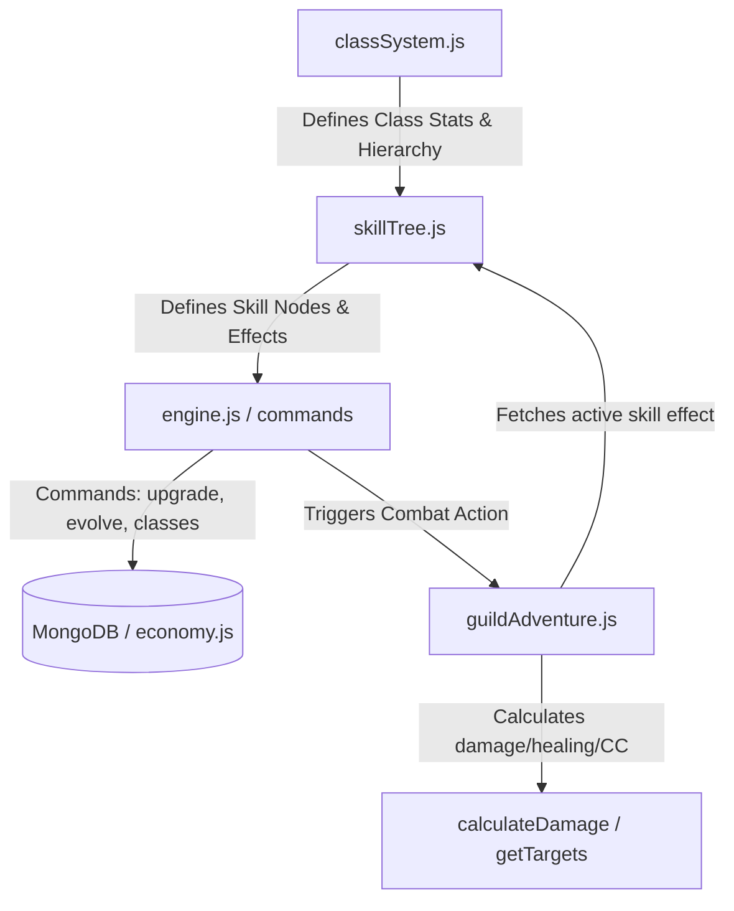
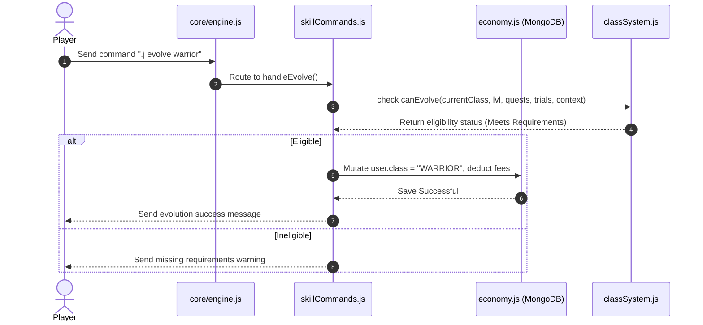
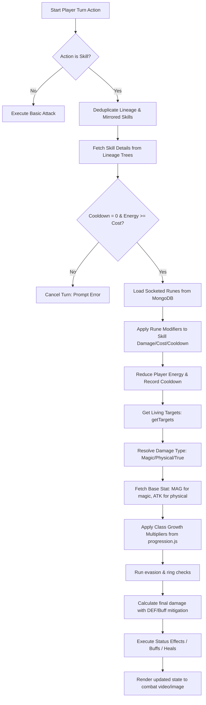

# 🎭 RPG Class and Skill Pipeline Guide

This guide walks through the architecture, configuration, and execution pipeline of the RPG Character Classes and Abilities (Skills) system inside the `whatsapp-bot` project. 

---

## 🗺️ 1. System Architecture Overview

The classes and skills system follows a modular pipeline spanning database layers, static configuration tables, user commands, and the combat execution engine.



### Key Files Involved
1. **[classSystem.js](file:///home/mellow/Desktop/Projects/Joker/whatsapp-bot/core/rpg/classSystem.js)**: Configures all playable Starter, Evolved, and Ascended classes, stat templates, evolution requirements, and adventurer ranks.
2. **[skillTree.js](file:///home/mellow/Desktop/Projects/Joker/whatsapp-bot/core/rpg/skillTree.js)**: Holds the `SKILL_TREES` object defining every class's abilities, cooldowns, costs, and combat effects.
3. **[progression.js](file:///home/mellow/Desktop/Projects/Joker/whatsapp-bot/core/rpg/progression.js)**: Controls XP leveling calculations, stat growth per level, and class stat multipliers.
4. **[classCommands.js](file:///home/mellow/Desktop/Projects/Joker/whatsapp-bot/core/commands/classCommands.js)**: Code logic behind `.j classes` and `.j class <id>` (evolution tree display).
5. **[skillCommands.js](file:///home/mellow/Desktop/Projects/Joker/whatsapp-bot/core/commands/skillCommands.js)**: Controls `.j abilities`, `.j upgrade skill`, and `.j reset skills`.
6. **[guildAdventure.js](file:///home/mellow/Desktop/Projects/Joker/whatsapp-bot/core/rpg/guildAdventure.js)**: The turn-based multiplayer combat loop where skills are validated (energy, cooldowns), runes are applied, and damage calculation is executed.

---

## 🎭 2. Setting Up Character Classes (`classSystem.js`)

Classes in the RPG are defined in `STARTER_CLASSES` and `EVOLVED_CLASSES` collections. They represent three progression tiers: **Starter** $\rightarrow$ **Evolved (Lv. 20)** $\rightarrow$ **Ascended (Lv. 50)**.

### A. Starter Class Structure
Starter classes have no predecessor and represent the root of an evolution tree:

```javascript
const STARTER_CLASSES = {
    FIGHTER: {
        id: 'FIGHTER',
        name: 'Fighter',
        icon: '⚔️',
        desc: `A well-rounded warrior who has hardened their body through relentless training.`,
        tier: 'STARTER',
        role: 'TANK',
        stats: { hp: 120, atk: 12, def: 10, mag: 4, spd: 8, luck: 6, crit: 8 },
        evolves_into: ['WARRIOR', 'BERSERKER', 'PALADIN', 'DRAGONSLAYER'],
    },
    // ...
};
```

### B. Evolved & Ascended Class Structure
Evolved and Ascended classes require predecessor relationships and strict criteria gating their unlock.

```javascript
const EVOLVED_CLASSES = {
    WARRIOR: {
        id: 'WARRIOR',
        name: 'Warrior',
        icon: '⚔️',
        desc: `A wall of iron and will. Warriors anchor the battlefield.`,
        tier: 'EVOLVED',
        evolvedFrom: 'FIGHTER',
        role: 'TANK',
        stats: { hp: 220, atk: 18, def: 22, mag: 2, spd: 5, luck: 5, crit: 5 },
        requirement: { 
            level: 15, 
            questsCompleted: 15, 
            trialBoss: 'INFECTED_COLOSSUS' 
        },
        evolutionCost: 0,
        passive: { name: 'Tenacity', desc: `Regenerates 3% of max HP every 2 turns in combat.` },
        evolves_into: ['WARLORD'],
    },
    // ...
};
```

#### Key Fields for Evolution:
- `evolvedFrom`: Parent class identifier (e.g. `FIGHTER`).
- `requirement`: Object stating requirements checking player properties:
  - `level`: Minimum character level.
  - `questsCompleted`: Total lifetime quests.
  - `trialBoss`: Boss ID they must defeat during evolution.
  - `gold`/`goldEarned`/`kills`/`dragonsKilled`/`undeadKills`/`victories`: Specific achievements or currency gates.
- `evolutionCost`: Zeni fee deducted upon evolution.

---

## 🌳 3. Defining Skills and Abilities (`skillTree.js`)

Skills are stored in the global `SKILL_TREES` object. Each class maps to trees representing different stances/specializations containing individual skill nodes.

### A. Skill Tree Structure Template

```javascript
const SKILL_TREES = {
    FIGHTER: {
        name: 'Fighter',
        icon: '⚔️',
        skillPointsPerLevel: 1,
        trees: {
            OFFENSE: {
                name: 'Offensive Stance',
                icon: '⚔️',
                color: '🔴',
                skills: {
                    slash: {
                        id: 'slash',
                        name: 'Power Slash',
                        tier: 1,
                        maxLevel: 5,
                        cost: 10,          // Deprecated in favor of energyCost array below
                        cooldown: 1,       // Cooldown in turns
                        desc: 'A powerful sword strike',
                        requires: null,    // If prerequisite skills exist, e.g., { slash: 3 }
                        effect: (level) => ({
                            type: 'damage',
                            multiplier: 1.2 + (level * 0.1),
                            damageType: 'physical',
                            animation: '⚔️💥'
                        })
                    },
                    // ...
                }
            },
            // ...
        }
    }
};
```

### B. New Scaling Format (Arrays)
Modern skills in the system define arrays for properties like `cooldown`, `energyCost`, `damageMultiplier`, and `effects` which scale progressively with the skill level:

```javascript
cleave: {
    id: 'cleave',
    name: 'Cleave',
    tier: 2,
    maxLevel: 5,
    targeting: 'CLEAVE',
    maxTargets: 2,
    damageType: 'PHYSICAL',
    cooldown: [2, 2, 2, 2, 2],
    energyCost: [15, 18, 20, 22, 25],
    damageMultiplier: [1.2, 1.35, 1.5, 1.65, 1.8],
    description: 'Strikes up to 2 adjacent enemies with physical force.',
    animation: '⚔️🌀',
    requires: { slash: 3 }
}
```

### C. Resolving Skill Effects in Combat
The engine calls `skillTree.getSkillEffect(ability, level)` during battle. It resolves both callback functions `effect(level)` and array-based configs, normalizing them into a uniform payload:

```javascript
{
    type: 'damage' | 'aoe' | 'execute' | 'buff_self' | 'buff_team' | 'heal' | 'heal_team' | 'revive' | 'damage_cc' | 'damage_dot' | 'passive',
    damageType: 'physical' | 'magic' | 'true',
    targets: Number | undefined,
    multiplier: Number,
    cost: Number,
    cooldown: Number,
    animation: String,
    // CC / DOT / Buff fields flattened from skill.effects:
    cc: String,          // e.g. 'stun'
    ccChance: Number,    // e.g. 50 (%)
    ccDuration: Number   // e.g. 1 (turn)
}
```

---

## ⚙️ 4. Class Progression & Evolution Pipeline



### Step 1: Upgrading a Skill
1. When a player levels up, the XP loop in [progression.js](file:///home/mellow/Desktop/Projects/Joker/whatsapp-bot/core/rpg/progression.js) awards skill points based on their class's `skillPointsPerLevel` property.
2. The user runs `.j upgrade skill <skill_id>`.
3. `skillCommands.js` calls `skillTree.ensureSkillPointsInitialized` to make sure spent + unspent points match the player's level-earned points.
4. It traverses the player's class lineage (`classSystem.getLineage(userClass.id)`) to check if they have access to the skill.
5. If prerequisites (`requires`) are met and points are available, the level is incremented in `user.skills[skillId]`, points are deducted, and `economy.saveUser()` commits it to MongoDB.

### Step 2: Class Evolution Check
1. The user runs `.j evolve <target_class>`.
2. The code uses `classSystem.canEvolve(userClass, level, quests, dragonsKilled, trials, context)`.
3. If they meet the prerequisites but lack the `trialBoss` flag in `completedTrials`, the evolution command locks.
4. The user runs `.j evolve <target_class>` again. If they have all pre-requisites but the boss defeat, the engine triggers the solo **Trial Boss** fight.
5. Once the trial boss is slain, the boss ID is appended to `user.completedTrials` and the user ascends to the chosen class on their next evolution attempt.

---

## ⚔️ 5. Combat Action Pipeline (`guildAdventure.js`)

During a quest battle, when it is a player's turn to act, the system processes skill casting via the following sequence:



### Critical Calculations in Combat:
1. **Stat Scaling**: In-combat stats are calculated by multiplying the player's level-up base stats by their class's `STAT_GROWTH.CLASS_MODIFIERS` multipliers configured in `progression.js`.
2. **Damage Scaling**:
   ```javascript
   const baseStat = damageType === 'magic' ? stats.mag : stats.atk;
   const rawPower = Math.floor(baseStat * multiplier);
   const finalDmg = calculateDamage(attacker, defender, rawPower, damageType, ...);
   ```
3. **Weapon Synergy**: Main-hand weapon types multiply damage if they match the skill's combat archetype (calculated in `weaponSynergy.js`).
4. **AOE Crit Diminishing Returns**: To keep area-of-effect spells balanced, successive hits in a single multi-target skill cast penalize crit chance by $15\%$ per hit, preventing whole-board critical sweeps.

---

## 📝 6. Example: Adding a New Class and Skills

Here is a step-by-step example of how you would configure a new evolution line starting from **SCOUT** into an evolved class **RANGER** and an ascended class **BEASTMASTER**.

### Step 1: Register Classes in `classSystem.js`

```javascript
// 1. In STARTER_CLASSES under 'SCOUT', add 'RANGER' to evolves_into
SCOUT: {
    // ...
    evolves_into: ['ROGUE', 'MONK', 'SAMURAI', 'NINJA', 'RANGER'],
}

// 2. In EVOLVED_CLASSES, append the new RANGER and BEASTMASTER entries
const EVOLVED_CLASSES = {
    // ...
    RANGER: {
        id: 'RANGER',
        name: 'Ranger',
        icon: '🏹',
        desc: 'A wilderness hunter skilled at tracking and long-range archery.',
        tier: 'EVOLVED',
        evolvedFrom: 'SCOUT',
        role: 'DPS',
        stats: { hp: 190, atk: 22, def: 10, mag: 10, spd: 22, luck: 18, crit: 20 },
        requirement: { level: 20, questsCompleted: 25, trialBoss: 'MUTATION_PRIME' },
        evolutionCost: 5000,
        passive: { name: 'Eagle Eye', desc: 'Increases accuracy by 15% and basic attack range.' },
        evolves_into: ['BEASTMASTER']
    },
    
    BEASTMASTER: {
        id: 'BEASTMASTER',
        name: 'Beastmaster',
        icon: '🐾',
        desc: 'Commands untamed predators of the wild to tear down foes.',
        tier: 'ASCENDED',
        evolvedFrom: 'RANGER',
        role: 'DPS',
        stats: { hp: 450, atk: 45, def: 20, mag: 30, spd: 40, luck: 30, crit: 35 },
        requirement: { level: 50, questsCompleted: 100, gold: 100000, trialBoss: 'GAIA_SENTINEL' },
        evolutionCost: 100000,
        passive: { name: 'Pack Hunter', desc: 'Summons deal 25% extra damage. Party gains +10% Speed.' }
    }
};
```

### Step 2: Set Level Stat Growth in `progression.js`

Under `STAT_GROWTH.CLASS_MODIFIERS`, configure how stats grow per level for the new classes:

```javascript
RANGER: { hp: 1.1, atk: 1.5, def: 0.9, mag: 0.8, spd: 1.8, luck: 1.4, crit: 2.0 },
BEASTMASTER: { hp: 1.4, atk: 1.8, def: 1.2, mag: 1.5, spd: 2.2, luck: 1.8, crit: 2.5 }
```

### Step 3: Define Skills in `skillTree.js`

Add the skill configurations inside `SKILL_TREES` mapping to the new class keys:

```javascript
const SKILL_TREES = {
    // ...
    RANGER: {
        name: 'Ranger',
        icon: '🏹',
        skillPointsPerLevel: 1,
        trees: {
            ARCHERY: {
                name: 'Archery Stance',
                icon: '🏹',
                color: '🟢',
                skills: {
                    steady_shot: {
                        id: 'steady_shot',
                        name: 'Steady Shot',
                        tier: 1,
                        maxLevel: 5,
                        cooldown: [1, 1, 1, 1, 1],
                        energyCost: [10, 12, 14, 16, 18],
                        damageMultiplier: [1.3, 1.45, 1.6, 1.75, 1.9],
                        damageType: 'PHYSICAL',
                        description: 'A focused arrow shot dealing high physical damage.',
                        animation: '🏹💥',
                        requires: null
                    },
                    barrage: {
                        id: 'barrage',
                        name: 'Arrow Barrage',
                        tier: 2,
                        maxLevel: 5,
                        targeting: 'AOE',
                        targets: 3,
                        cooldown: [3, 3, 3, 3, 3],
                        energyCost: [20, 22, 24, 26, 28],
                        damageMultiplier: [0.9, 1.05, 1.2, 1.35, 1.5],
                        damageType: 'PHYSICAL',
                        description: 'Fires a volley of arrows hitting up to 3 targets.',
                        animation: '🏹🌀',
                        requires: { steady_shot: 3 }
                    }
                }
            }
        }
    },
    
    BEASTMASTER: {
        name: 'Beastmaster',
        icon: '🐾',
        skillPointsPerLevel: 1,
        trees: {
            FERAL: {
                name: 'Feral bond',
                icon: '🐾',
                color: '🔴',
                skills: {
                    summon_wolf: {
                        id: 'summon_wolf',
                        name: 'Summon Alpha Wolf',
                        tier: 1,
                        maxLevel: 3,
                        cooldown: [5, 5, 5],
                        energyCost: [30, 35, 40],
                        description: 'Summons an Alpha Wolf to fight alongside the party.',
                        animation: '🐺✨',
                        requires: null,
                        effect: (level) => ({
                            type: 'buff_team',
                            buffType: 'attack',
                            value: 15 + (level * 5),
                            duration: 3
                        })
                    }
                }
            }
        }
    }
};
```


# Classes Command Flow (`classes`)

## 1. Description
The `classes` command displays a structured directory of all starter, evolved, and ascended classes, roles, passive abilities, and evolution trees. When a user queries a specific class (e.g. `.j class warrior`), it displays a graphical evolution tree showing the ancestor/descendant relationships and requirement gates.

---

## 2. Hierarchical Execution Tree
```text
======================================================
📂 CLASSES DIRECTORY: User sends ".j classes"
======================================================
User command
└── core/engine.js
    └── messages.upsert handler (L4066)
        └── Command detection & prefix check (L4558)
        └── Match check: primaryCmd === "classes" (L4850)
            └── core/commands/classCommands.js
                └── displayClasses(sock, chatId) (L20)
                    ├── classSystem.getAllClasses()
                    ├── Group by tier (Starter, Evolved, Ascended) & sort by role
                    └── sock.sendMessage(chatId, { text: classesGuideMsg })

======================================================
🌳 CLASS EVOLUTION TREE: User sends ".j class warrior" or ".j class info"
======================================================
User command
└── core/engine.js
    └── Match check: lowerTxt === ".j character" || isClassCmd (L6877)
        └── isClassCmd evaluation (L6876 / L6886-6898)
            └── core/commands/classCommands.js
                └── displayEvolutionTree(sock, chatId, classId) (L87)
                    ├── Walk up parent lineage: classSystem.getLineage(classId)
                    ├── Recursive tree builder starting from root
                    └── sock.sendMessage(chatId, { text: treeMsg })
```

---

## 3. Step-by-Step Code Execution Flow

### Step 1: Entry Point Trigger
* **File Path**: [core/engine.js](https://github.com/BrainMell/whatsapp-bot/blob/main/core/engine.js#L4066)
* **Line Numbers**: 4066-4074
* **Called From**: Baileys socket event emitter
* **Inputs**: `{ messages, type }` WhatsApp payload
* **Outputs**: None

```javascript
        sock.ev.on("messages.upsert", async ({ messages, type }) => {
          if (type !== "notify" && type !== "append") return;
          if (isRekeying) return;

          await Promise.all(
            messages.map(async (m) => {
              if (!m.message) return;
```

#### Explanation
- Receives message updates from WhatsApp events.

---

### Step 2: Command Matching and Route Execution
* **File Path**: [core/engine.js](https://github.com/BrainMell/whatsapp-bot/blob/main/core/engine.js#L4849-L4855) / [L6875-L6907](https://github.com/BrainMell/whatsapp-bot/blob/main/core/engine.js#L6875-L6907)
* **Line Numbers**: 4849-4855 (classes) & 6875-6907 (class tree/info)
* **Called From**: Message parser block in `engine.js`
* **Inputs**: Raw message body string `lowerTxt`
* **Outputs**: Calls `classCommands.displayClasses` or `classCommands.displayEvolutionTree`

```javascript
                    // .j classes
                    if (primaryCmd === "classes") {
                      await classCommands.displayClasses(sock, chatId);
                      return;
                    }
```

```javascript
                  const isClassCmd = lowerTxt === `${botConfig.getPrefix().toLowerCase()} class` || lowerTxt.startsWith(`${botConfig.getPrefix().toLowerCase()} class `);
                  if (
                    lowerTxt ===
                      `${botConfig.getPrefix().toLowerCase()} character` ||
                    lowerTxt ===
                      `${botConfig.getPrefix().toLowerCase()} char` ||
                    lowerTxt ===
                      `${botConfig.getPrefix().toLowerCase()} stats` ||
                    isClassCmd
                  ) {
                    if (isClassCmd) {
                      const args = txt.trim().split(/\s+/).slice(2);
                      if (args.length > 0) {
                        let targetClassId = args[0];
                        if (targetClassId.toLowerCase() === "info") {
                          const sheet = progression.getCharacterSheet(senderJid);
                          targetClassId = sheet ? sheet.class : null;
                        }
                        if (targetClassId) {
                          await classCommands.displayEvolutionTree(sock, chatId, targetClassId);
                          return;
                        }
                      }
                    }
                    // ... (displayCharacterSheet fallback)
```

#### Explanation
- If the command matches `.j classes`, routes to `displayClasses()`.
- If the command matches `.j class <class_id>` or `.j class info`, extracts the requested class and routes to `displayEvolutionTree()`.

---

### Step 3: Formatting the Evolution Tree
* **File Path**: [core/commands/classCommands.js](https://github.com/BrainMell/whatsapp-bot/blob/main/core/commands/classCommands.js#L87-L137)
* **Line Numbers**: 87-137
* **Called From**: `displayEvolutionTree()`
* **Inputs**: `(sock, chatId, classId)`
* **Outputs**: Dispatches a diagram of the evolution paths

```javascript
async function displayEvolutionTree(sock, chatId, classId) {
    const classes = classSystem.getAllClasses();
    const targetClass = classSystem.getClassById(classId?.toUpperCase());
    
    if (!targetClass) {
        await sock.sendMessage(chatId, { text: `❌ Class "${classId}" not found.` });
        return;
    }
    
    let msg = `┏━━━━━━━━━━━━━━━┓\n┃ 🌳 *EVOLUTION*  ┃\n┗━━━━━━━━━━━━━━━┛\n\n`;
    
    // Walk up lineage to root
    const lineage = classSystem.getLineage(targetClass.id);
    const root = classSystem.getClassById(lineage[lineage.length - 1]);
    
    // Build tree recursively
    function buildTree(cls, depth = 0) {
        const indent = '  '.repeat(depth);
        const connector = depth > 0 ? '└─ ' : '';
        const isTarget = cls.id === targetClass.id;
        const nameStr = isTarget ? `*${cls.icon} ${cls.name}* ◄ YOU` : `${cls.icon} ${cls.name}`;
        
        msg += `${indent}${connector}${nameStr} _(${cls.tier})_\n`;
        
        if (cls.evolves_into?.length > 0) {
            for (const evoId of cls.evolves_into) {
                const evoClass = classes[evoId];
                if (evoClass) buildTree(evoClass, depth + 1);
            }
        }
    }
    
    if (root) buildTree(root);
    // ... (append requirements: Level, Quests, Zeni, etc.)
    await sock.sendMessage(chatId, { text: msg });
}
```

#### Explanation
1. Checks class existence using `classSystem.getClassById()`.
2. Resolves the lineage root class by walking up the ancestors tree via `classSystem.getLineage()`.
3. Recursively constructs a text-based hierarchy layout starting from the ancestor down to all its possible evolution leaf nodes, marking the target class with `◄ YOU`.
4. Appends specific requirements for evolving into the target class.
5. Sends the result back to WhatsApp.

---

### Step 4: Lineage Walk API
* **File Path**: [core/rpg/classSystem.js](https://github.com/BrainMell/whatsapp-bot/blob/main/core/rpg/classSystem.js#L747-L757)
* **Line Numbers**: 747-757
* **Called From**: `classSystem.getLineage()`
* **Inputs**: `(classId)`
* **Outputs**: Array of lineage IDs ordered from leaf to root

```javascript
function getLineage(classId) {
    const lineage = [];
    let currentId = classId;
    while (currentId) {
        lineage.push(currentId);
        const classData = getClassById(currentId);
        if (!classData?.evolvedFrom) break;
        currentId = classData.evolvedFrom;
    }
    return lineage;
}
```

#### Explanation
- Loop executes while there is an active class node parent.
- Traverses the hierarchy upwards using the `evolvedFrom` attribute.
- Collects and returns the lineage path array.

---

## 4. How to Modify

### How to Add a New Character Class
To add a brand new playable starter class or advanced evolution:
1. **Define the Class Object**:
   * Open [core/rpg/classSystem.js](https://github.com/BrainMell/whatsapp-bot/blob/main/core/rpg/classSystem.js).
   * **If a Starter Class**: Add your class entry to the `STARTER_CLASSES` object:
     ```javascript
     ARCHER: {
         id: 'ARCHER',
         name: 'Archer',
         icon: '🏹',
         desc: 'A marksman who strikes from afar with precision.',
         tier: 'STARTER',
         role: 'DPS',
         stats: { hp: 95, atk: 11, def: 6, mag: 2, spd: 13, luck: 10, crit: 15 },
         evolves_into: ['HUNTER', 'SNIPER'] // Evolved classes ids
     }
     ```
   * **If an Evolved/Ascended Class**: Add your class entry to the `EVOLVED_CLASSES` object:
     ```javascript
     HUNTER: {
         id: 'HUNTER',
         name: 'Hunter',
         icon: '🐾',
         desc: 'A master of traps and companion beasts.',
         tier: 'EVOLVED',
         evolvedFrom: 'ARCHER',
         role: 'DPS',
         stats: { hp: 200, atk: 22, def: 12, mag: 5, spd: 22, luck: 15, crit: 20 },
         requirement: { level: 15, questsCompleted: 20, trialBoss: 'MUTATION_PRIME' },
         evolutionCost: 5000,
         passive: { name: 'Beast Mastery', desc: 'Increases all hunting yields by 20%.' },
         evolves_into: ['BEASTMASTER']
     }
     ```

---

### How to Configure Class Evolution Trees and Commands
* **Modify Evolution Requirements**: Edit the `requirement` parameters in `EVOLVED_CLASSES` (e.g., `level`, `questsCompleted`, `victories`, `gold`, `trialBoss`). The evolution checks are automatically validated in [core/commands/classCommands.js](https://github.com/BrainMell/whatsapp-bot/blob/main/core/commands/classCommands.js).
* **Customize evolution branch symbols**: To change the formatting characters used in the tree graphics (`└─`, `├─`), modify the formatting loops in `printClassTree()` inside [core/commands/classCommands.js](https://github.com/BrainMell/whatsapp-bot/blob/main/core/commands/classCommands.js#L109).
* **Administrative Evolution Overrides**: Admin-level users can bypass prerequisites to change classes using `.j admin forceevolve <@user> <class>` or switch their own class using `.j modclass <class>` (see [Admin Subsystem commands](file:///home/mellow/Desktop/Projects/Joker/whatsapp-bot/docs/admin/commands.md)).


---

## 5. Complete Class & Adventurer Rank Reference Manual

This reference section outlines all playable classes, stats, roles, passives, and progression gates configured in the RPG engine, as well as the adventurer ranks database.

### 5.1 Playable Classes Catalog
All playable character classes are defined in [`core/rpg/classSystem.js`](file:///home/mellow/Desktop/Joker/whatsapp-bot/core/rpg/classSystem.js). They are structured in 3 distinct tiers: Starter, Evolved, and Ascended.

#### Tier 1: Starter Classes
Starter classes have no requirements or unlock costs and act as the roots of the evolution tree:

| Class ID | Icon / Name | Role | Base Stats (hp, atk, def, mag, spd, luck, crit) | Evolves Into (Evolved Class IDs) |
|:---|:---|:---|:---|:---|
| `FIGHTER` | ⚔️ Fighter | TANK | `120, 12, 10, 4, 8, 6, 8%` | `WARRIOR`, `BERSERKER`, `PALADIN`, `DRAGONSLAYER` |
| `SCOUT` | 🗡️ Scout | DPS | `90, 10, 5, 3, 16, 14, 18%` | `ROGUE`, `MONK`, `SAMURAI`, `NINJA` |
| `APPRENTICE` | 🔮 Apprentice | MAGIC_DPS | `80, 5, 4, 18, 9, 8, 10%` | `MAGE`, `WARLOCK`, `ELEMENTALIST`, `NECROMANCER`, `CHRONOMANCER` |
| `ACOLYTE` | ✨ Acolyte | SUPPORT | `100, 6, 8, 14, 10, 12, 6%` | `CLERIC`, `DRUID`, `MERCHANT`, `BARD`, `ARTIFICER` |

#### Tier 2: Evolved Classes
Evolved classes are unlocked by using an **Evolution Stone (T2)**. Requirements are gated by: Level, Quests Completed, and defeating a specific solo **Trial Boss**:

| Class ID | Icon / Name | Evolved From | Role | Base Stats | Passive Name & Description | Requirements |
|:---|:---|:---|:---|:---|:---|:---|
| `WARRIOR` | ⚔️ Warrior | `FIGHTER` | TANK | `220, 18, 22, 2, 5, 5, 5%` | **Tenacity**: Regen 3% max HP every 2 turns. | Level 15, 15 Quests, trialBoss: `INFECTED_COLOSSUS` |
| `BERSERKER` | 🪓 Berserker | `FIGHTER` | TANK | `220, 18, 12, 1, 6, 4, 15%` | **Bloodlust**: CRIT increases by 1% per 5% HP missing. | Level 15, 15 Quests, trialBoss: `MUTATION_PRIME` |
| `PALADIN` | 🛡️ Paladin | `FIGHTER` | TANK | `180, 10, 22, 8, 4, 10, 5%` | **Divine Shield**: -10% dmg taken; -50% from Undead. | Level 15, 15 Quests, trialBoss: `CORRUPTED_GUARDIAN` |
| `DRAGONSLAYER` | 🐲⚔️ Dragonslayer | `FIGHTER` | TANK | `190, 16, 15, 4, 8, 8, 12%` | **Dragon Bane**: 3× damage to Dragons. Immune to fire DoT. | Level 40, 30 Quests, 150k Zeni, trialBoss: `ELDER_FLAME` |
| `ROGUE` | 🗡️ Rogue | `SCOUT` | DPS | `100, 18, 5, 3, 20, 15, 25%` | **Shadow Step**: Evasion +15%. | Level 15, 15 Quests, trialBoss: `SHADOW_STALKER` |
| `MONK` | 🥋 Monk | `SCOUT` | DPS | `120, 14, 8, 6, 18, 10, 15%` | **Inner Focus**: +10% Accuracy, +10% Speed. | Level 15, 15 Quests, trialBoss: `IRON_BODY_GRANDMASTER` |
| `SAMURAI` | ⚔️🌸 Samurai | `SCOUT` | DPS | `130, 17, 9, 4, 16, 11, 20%` | **Bushido**: +20% ATK after standing still for 1 turn. | Level 15, 15 Quests, trialBoss: `ANCIENT_WURM` |
| `NINJA` | 🥷 Ninja | `SCOUT` | DPS | `95, 16, 4, 5, 22, 16, 28%` | **Opening Strike**: First attack is a guaranteed CRIT. | Level 15, 15 Quests, trialBoss: `SHADOW_LORD` |
| `MAGE` | 🔮 Mage | `APPRENTICE` | MAGIC_DPS | `110, 8, 8, 35, 12, 12, 8%` | **Arcane Well**: Regenerates 10 Energy per turn. | Level 15, 15 Quests, trialBoss: `ARCANE_SENTINEL` |
| `WARLOCK` | 👹 Warlock | `APPRENTICE` | MAGIC_DPS | `100, 7, 6, 26, 8, 10, 12%` | **Soul Siphon**: Heals for 8% of magic damage dealt. | Level 15, 15 Quests, trialBoss: `SOUL_EATER` |
| `ELEMENTALIST` | 🌊 Elementalist | `APPRENTICE` | MAGIC_DPS | `95, 7, 6, 28, 10, 11, 13%` | **Elemental Harmony**: Elemental dmg +15%. | Level 15, 15 Quests, trialBoss: `ELEMENTAL_PRIMORDIAL` |
| `NECROMANCER` | 💀 Necromancer | `APPRENTICE` | MAGIC_DPS | `92, 6, 5, 27, 8, 9, 11%` | **Death's Apprentice**: Summons have +30% stats. | Level 15, 15 Quests, trialBoss: `GRAVEYARD_LORD` |
| `CHRONOMANCER` | ⏳ Chronomancer | `APPRENTICE` | MAGIC_DPS | `88, 6, 6, 28, 14, 13, 12%` | **Temporal Flow**: Cooldowns reduced by 1. | Level 15, 15 Quests, trialBoss: `CHRONOS_WARDEN` |
| `CLERIC` | ✨🙏 Cleric | `ACOLYTE` | SUPPORT | `110, 7, 9, 20, 9, 13, 7%` | **Divine Grace**: Healing spells are 25% stronger. | Level 15, 15 Quests, trialBoss: `CORRUPTED_GUARDIAN` |
| `DRUID` | 🌿 Druid | `ACOLYTE` | SUPPORT | `115, 8, 10, 18, 11, 12, 8%` | **Wild Shape**: Can transform each combat. | Level 15, 15 Quests, trialBoss: `FOREST_ANCESTOR` |
| `MERCHANT` | 💰 Merchant | `ACOLYTE` | SUPPORT | `105, 7, 8, 12, 10, 25, 9%` | **Market Advantage**: Earn 50% more Zeni. | Level 15, 15 Quests, trialBoss: `GOLDEN_GOLEM` |
| `BARD` | 🎸 Bard | `ACOLYTE` | SUPPORT | `100, 8, 7, 16, 12, 14, 10%` | **Inspiring Song**: Party members gain +10% stats. | Level 15, 15 Quests, trialBoss: `SOUND_REAPER` |
| `ARTIFICER` | 🔧 Artificer | `ACOLYTE` | SUPPORT | `108, 9, 9, 15, 11, 11, 11%` | **Overclocked**: Summons deal 40% more damage. | Level 15, 15 Quests, trialBoss: `CLOCKWORK_TITAN` |

#### Tier 3: Ascended Classes
Ascended classes require an **Ascension Stone (T3)** and **100,000+ Zeni** to unlock, as well as specific kill counts or achievements:

| Class ID | Icon / Name | Evolved From | Role | Base Stats | Passive Name & Description | Requirements |
|:---|:---|:---|:---|:---|:---|:---|
| `WARLORD` | 🎖️ Warlord | `WARRIOR` | TANK | `550, 28, 48, 5, 12, 10, 12%` | **Iron Command**: Party takes -15% dmg in multiplayer. | Level 50, 100 Quests, 100 Victories, 100k gold, trialBoss: `VOID_CORRUPTED` |
| `DOOMSLAYER` | 🔥🪓 Doomslayer | `BERSERKER` | TANK | `600, 55, 25, 2, 18, 5, 30%` | **Hell-Walker**: +2% dmg per 1% HP missing. No cap. | Level 50, 100 Quests, 500 Kills, 100k gold, trialBoss: `DEMON_LORD` |
| `TEMPLAR` | ⛪ Templar | `PALADIN` | TANK | `460, 22, 52, 30, 10, 20, 12%` | **Holy Retribution**: Reflect 20% damage taken as holy damage. | Level 50, 100 Quests, 200 Undead Kills, 100k gold, trialBoss: `PRIMORDIAL_CHAOS` |
| `DRAGON_GOD` | 🐲👑 Dragon God | `DRAGONSLAYER` | TANK | `550, 45, 40, 35, 15, 25, 20%` | **Dragon Heart**: Status immune. Reduces dmg taken by 50%. | Level 75, 200 Quests, 200 Dragons Killed, 500k gold, trialBoss: `LEVIATHAN` |
| `NIGHTBLADE` | 🌑🗡️ Nightblade | `ROGUE` | DPS | `250, 42, 12, 15, 50, 35, 45%` | **Assassin's Mark**: 10% chance to deal 10× damage on attack. | Level 50, 100 Quests, 100k gold, trialBoss: `VOID_ASSASSIN` |
| `ZENMASTER` | 🧘 Zenmaster | `MONK` | DPS | `350, 38, 22, 35, 45, 25, 30%` | **Perfect Form**: Immune to stun. | Level 50, 100 Quests, 100k gold, trialBoss: `ETERNAL_DRAGON` |
| `SHOGUN` | 🏯⚔️ Shogun | `SAMURAI` | DPS | `320, 50, 28, 15, 25, 20, 35%` | **Commander's Will**: Party deals +20% physical damage. | Level 50, 100 Quests, 100k gold, trialBoss: `VOID_TITAN` |
| `KAGE` | 🌑🥷 Kage | `NINJA` | DPS | `220, 52, 15, 20, 55, 30, 50%` | **Absolute Stealth**: 50% base Evasion. | Level 50, 100 Quests, 100k gold, trialBoss: `PRIMORDIAL_EVIL` |
| `ARCHMAGE` | 🧙‍♂️✨ Archmage | `MAGE` | MAGIC_DPS | `200, 12, 18, 75, 22, 22, 22%` | **Infinity Flow**: Energy costs reduced by 50%. | Level 50, 100 Quests, 100k gold, trialBoss: `LICH_KING` |
| `VOIDWALKER` | 🌑🧙 Voidwalker | `WARLOCK` | MAGIC_DPS | `300, 18, 25, 65, 18, 15, 18%` | **Abyssal Aura**: Enemies ATK/DEF reduced by 15%. | Level 50, 100 Quests, 100k gold, trialBoss: `ABYSSAL_WHISPER` |
| `AVATAR` | 🌊🔥⚡🌍 Avatar | `ELEMENTALIST` | MAGIC_DPS | `250, 20, 22, 70, 28, 25, 25%` | **Elemental Avatar**: Match enemy elemental weakness automatically. | Level 50, 100 Quests, 100k gold, trialBoss: `PRIME_ELEMENT` |
| `LICH` | 💀👑 Lich | `NECROMANCER` | MAGIC_DPS | `300, 15, 25, 68, 20, 18, 20%` | **Phylactery**: Revives once per quest at 50% HP. | Level 50, 100 Quests, 100k gold, trialBoss: `VOID_NECROMANCER` |
| `TIMELORD` | ⏳👑 Time Lord | `CHRONOMANCER` | MAGIC_DPS | `240, 15, 20, 72, 60, 30, 25%` | **Temporal Mastery**: Takes 2 actions per turn. | Level 50, 100 Quests, 100k gold, trialBoss: `TIME_EATER` |
| `SAINT` | 😇 Saint | `CLERIC` | SUPPORT | `350, 22, 40, 65, 22, 35, 18%` | **Sainthood**: All healing spells output doubled. | Level 50, 100 Quests, 100k gold, trialBoss: `SERAPHIM_PRIME` |
| `ARCHDRUID` | 🌳👑 Archdruid | `DRUID` | SUPPORT | `400, 28, 38, 60, 28, 30, 22%` | **Nature's Wrath**: Regenerate 3% max HP per turn. | Level 50, 100 Quests, 100k gold, trialBoss: `GAIA_SENTINEL` |
| `TYCOON` | 💰👑 Tycoon | `MERCHANT` | SUPPORT | `300, 25, 30, 40, 25, 100, 30%` | **Infinite Capital**: Earns Zeni each turn in combat. | Level 50, 100 Quests, 500k gold earned, 200k gold, trialBoss: `TREASURE_HOARDER` |
| `VIRTUOSO` | 🎻✨ Virtuoso | `BARD` | SUPPORT | `280, 18, 20, 55, 30, 40, 25%` | **Grand Finale**: Can revive fallen allies. | Level 50, 100 Quests, 100k gold, trialBoss: `MAESTRO_OF_VOID` |
| `GRAND_INVENTOR` | 🦾⚙️ Grand Inventor | `ARTIFICER` | SUPPORT | `320, 25, 35, 35, 22, 25, 20%` | **Master Craftsman**: Doubles crafting outputs. | Level 50, 100 Quests, 100k gold, trialBoss: `MECH_GOD` |

---

### 5.2 Adventurer Rank Database
The Rank Progression is mapped in `classSystem.js` under `ADVENTURER_RANKS`. Upgrades require a minimum player Level, Quests Completed, and **Guild Points (GP)**:

| Rank ID | Icon / Name | Minimum Level | Quests Req. | GP Req. | Benefit (Quest Reward Bonus) |
|:---|:---|:---|:---|:---|:---|
| `F` | 🔰 F-Rank | 1 | 0 | 0 | +0% Zeni/Drop rewards |
| `E` | 🥉 E-Rank | 10 | 10 | 50 | +5% Zeni/Drop rewards |
| `D` | 🥈 D-Rank | 20 | 25 | 150 | +10% Zeni/Drop rewards |
| `C` | 🥇 C-Rank | 30 | 50 | 400 | +15% Zeni/Drop rewards |
| `B` | 💎 B-Rank | 40 | 80 | 800 | +20% Zeni/Drop rewards |
| `A` | 💠 A-Rank | 50 | 120 | 1,500 | +30% Zeni/Drop rewards |
| `S` | ⭐ S-Rank | 60 | 180 | 3,000 | +40% Zeni/Drop rewards |
| `SS` | 🌟 SS-Rank | 75 | 250 | 6,000 | +60% Zeni/Drop rewards |
| `SSS` | ✨ SSS-Rank | 90 | 500 | 12,000 | +100% Zeni/Drop rewards |
| `GOD` | ♾️ GOD-Rank | 100 | 1,000 | 25,000 | +200% Zeni/Drop rewards |

---

# **Noob Readthrough**

This section is dedicated to complete beginners. If you have never programmed before, this guide will explain the general programming concepts used in the code snippets above, how they work in practice, why we use them in this project, and what happens if you change or remove them.

### Concept 1: Variables
Variables are used to store and hold values in a program. They can be thought of as labeled boxes where you can store a value.
**General Example**
```javascript
let name = 'John';
console.log(name); // outputs: John
```
**In Our Code**
```javascript
const isRekeying = ...;
const primaryCmd = ...;
const lowerTxt = ...;
```
**How it works here**: Variables are used to store values such as `isRekeying`, `primaryCmd`, and `lowerTxt` which are then used in conditional statements and function calls.
**Why it's used**: Variables are used to store and reuse values in the program, making it easier to write and maintain the code.
**If you change/remove it**: If you remove a variable, the code will throw an error when trying to use it. If you change the value of a variable, it will affect the behavior of the program.

---
### Concept 2: Conditional Statements
Conditional statements are used to execute different blocks of code based on certain conditions. They are used to make decisions in the program.
**General Example**
```javascript
let age = 25;
if (age > 18) {
  console.log('You are an adult');
} else {
  console.log('You are a minor');
}
```
**In Our Code**
```javascript
if (type !== "notify" && type !== "append") return;
if (isRekeying) return;
if (lowerTxt === `${botConfig.getPrefix().toLowerCase()} character` || ...);
```
**How it works here**: Conditional statements are used to check conditions such as the type of message, whether rekeying is in progress, and the value of `lowerTxt`. Based on these conditions, the program executes different blocks of code.
**Why it's used**: Conditional statements are used to make decisions in the program and execute different blocks of code based on certain conditions.
**If you change/remove it**: If you remove a conditional statement, the program will not be able to make decisions based on the condition. If you change the condition, it will affect the behavior of the program.

---
### Concept 3: Functions
Functions are reusable blocks of code that perform a specific task. They can take arguments and return values.
**General Example**
```javascript
function greet(name) {
  console.log(`Hello, ${name}!`);
}
greet('John'); // outputs: Hello, John!
```
**In Our Code**
```javascript
async function displayEvolutionTree(sock, chatId, classId) {
  ...
}
```
**How it works here**: Functions are used to perform specific tasks such as displaying the evolution tree of a class. The `displayEvolutionTree` function takes arguments `sock`, `chatId`, and `classId` and returns a promise.
**Why it's used**: Functions are used to organize the code, make it reusable, and perform specific tasks.
**If you change/remove it**: If you remove a function, the code that calls it will throw an error. If you change the function, it will affect the behavior of the program.

---
### Concept 4: Array Methods
Array methods are used to perform operations on arrays such as mapping, filtering, and reducing.
**General Example**
```javascript
let numbers = [1, 2, 3, 4, 5];
let doubleNumbers = numbers.map(num => num * 2);
console.log(doubleNumbers); // outputs: [2, 4, 6, 8, 10]
```
**In Our Code**
```javascript
await Promise.all(
  messages.map(async (m) => {
    ...
  })
);
```
**How it works here**: The `map` method is used to transform the `messages` array into a new array of promises. The `Promise.all` method is then used to wait for all the promises to resolve.
**Why it's used**: Array methods are used to perform operations on arrays and make the code more concise and efficient.
**If you change/remove it**: If you remove the `map` method, the code will not be able to transform the `messages` array. If you change the `map` method, it will affect the behavior of the program.

---
### Concept 5: Promises
Promises are used to handle asynchronous operations and provide a way to execute code when a promise is resolved or rejected.
**General Example**
```javascript
let promise = new Promise((resolve, reject) => {
  setTimeout(() => {
    resolve('Hello, World!');
  }, 2000);
});
promise.then((message) => {
  console.log(message); // outputs: Hello, World!
});
```
**In Our Code**
```javascript
await Promise.all(
  messages.map(async (m) => {
    ...
  })
);
```
**How it works here**: Promises are used to handle asynchronous operations such as sending messages and displaying the evolution tree. The `await` keyword is used to wait for the promises to resolve.
**Why it's used**: Promises are used to handle asynchronous operations and provide a way to execute code when a promise is resolved or rejected.
**If you change/remove it**: If you remove the `Promise.all` method, the code will not be able to wait for all the promises to resolve. If you change the `Promise.all` method, it will affect the behavior of the program.

---
### Concept 6: Async/Await
Async/await is a syntax sugar on top of promises that makes it easier to write asynchronous code.
**General Example**
```javascript
async function greet() {
  let message = await new Promise((resolve, reject) => {
    setTimeout(() => {
      resolve('Hello, World!');
    }, 2000);
  });
  console.log(message); // outputs: Hello, World!
}
greet();
```
**In Our Code**
```javascript
async function displayEvolutionTree(sock, chatId, classId) {
  ...
}
```
**How it works here**: Async/await is used to write asynchronous code that is easier to read and maintain. The `async` keyword is used to define an asynchronous function, and the `await` keyword is used to wait for a promise to resolve.
**Why it's used**: Async/await is used to make asynchronous code easier to write and maintain.
**If you change/remove it**: If you remove the `async` keyword, the code will not be able to use the `await` keyword. If you change the `async` keyword, it will affect the behavior of the program.

---
### Concept 7: Event Listeners
Event listeners are used to listen for events such as messages, clicks, and keyboard input.
**General Example**
```javascript
document.addEventListener('click', () => {
  console.log('You clicked the document!');
});
```
**In Our Code**
```javascript
sock.ev.on("messages.upsert", async ({ messages, type }) => {
  ...
});
```
**How it works here**: Event listeners are used to listen for events such as messages being updated. The `sock.ev.on` method is used to listen for the `messages.upsert` event.
**Why it's used**: Event listeners are used to respond to events and perform actions based on user input or other events.
**If you change/remove it**: If you remove the event listener, the code will not be able to respond to the event. If you change the event listener, it will affect the behavior of the program.

---
### Concept 8: String Manipulation
String manipulation is used to perform operations on strings such as concatenation, substring, and replacement.
**General Example**
```javascript
let name = 'John';
let greeting = 'Hello, ' + name + '!';
console.log(greeting); // outputs: Hello, John!
```
**In Our Code**
```javascript
let targetClassId = args[0];
if (targetClassId.toLowerCase() === "info") {
  ...
}
```
**How it works here**: String manipulation is used to perform operations on strings such as concatenation and substring. The `toLowerCase` method is used to convert a string to lowercase.
**Why it's used**: String manipulation is used to perform operations on strings and make the code more efficient.
**If you change/remove it**: If you remove the string manipulation, the code will not be able to perform operations on strings. If you change the string manipulation, it will affect the behavior of the program.

---
### Concept 9: Object Properties
Object properties are used to access and modify the properties of an object.
**General Example**
```javascript
let person = { name: 'John', age: 30 };
console.log(person.name); // outputs: John
person.age = 31;
console.log(person.age); // outputs: 31
```
**In Our Code**
```javascript
const targetClass = classSystem.getClassById(classId?.toUpperCase());
```
**How it works here**: Object properties are used to access and modify the properties of an object. The `getClassById` method is used to access the `classSystem` object and retrieve a class by its ID.
**Why it's used**: Object properties are used to access and modify the properties of an object and make the code more efficient.
**If you change/remove it**: If you remove the object property, the code will not be able to access or modify the property. If you change the object property, it will affect the behavior of the program.

---
### Concept 10: Recursion
Recursion is a programming technique where a function calls itself repeatedly until it reaches a base case.
**General Example**
```javascript
function factorial(n) {
  if (n === 0) {
    return 1;
  } else {
    return n * factorial(n - 1);
  }
}
console.log(factorial(5)); // outputs: 120
```
**In Our Code**
```javascript
function buildTree(cls, depth = 0) {
  ...
  if (cls.evolves_into?.length > 0) {
    for (const evoId of cls.evolves_into) {
      const evoClass = classes[evoId];
      if (evoClass) buildTree(evoClass, depth + 1);
    }
  }
}
```
**How it works here**: Recursion is used to build the evolution tree of a class. The `buildTree` function calls itself repeatedly until it reaches a base case.
**Why it's used**: Recursion is used to solve problems that have a recursive structure.
**If you change/remove it**: If you remove the recursion, the code will not be able to build the evolution tree. If you change the recursion, it will affect the behavior of the program.
